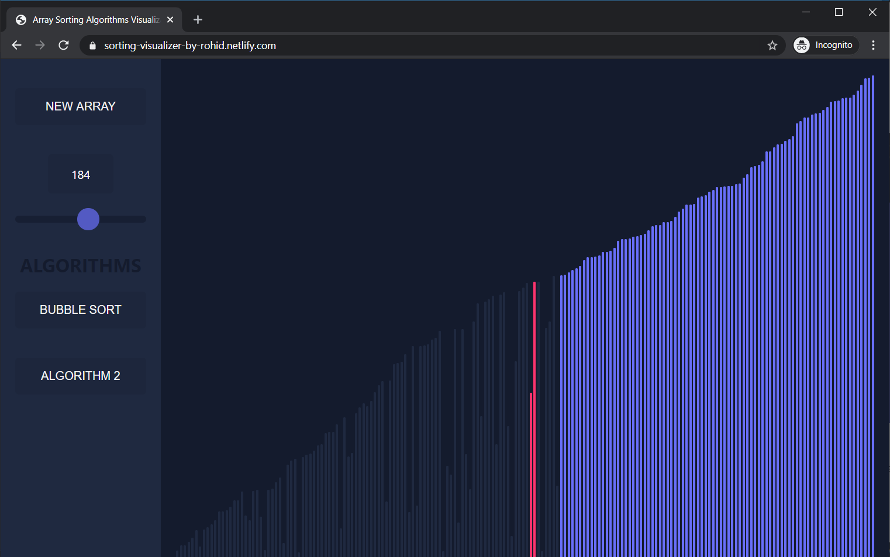

<p align="center">

  <h1 align="center">Sorting Visualizer</h1>

  <p align="center">
    This is a sorting visualizer where it visualize how a sorting algorithm works in the background.
    <br />
    <br />
    <a href="https://sorting-visualizer-by-rohid.netlify.com/">View Demo</a>
    ·
    <a href="https://github.com/rohid-hub/Sorting_Visualizer/issues">Report Bug</a>
    ·
    <a href="https://github.com/rohid-hub/Sorting_Visualizer/issues">Request Feature</a>
  </p>
</p>


<!-- TABLE OF CONTENTS -->
## Table of Contents

* [About the Project](#about-the-project)
  * [Built With](#built-with)
* [Getting Started](#getting-started)
  * [Pre Requirments](#pre-requirements)
  * [Installation](#installation)
* [Contact](#contact)

  


<!-- ABOUT THE PROJECT -->
## About The Project

<p align="center"><p>

This a sorting visualizer project where you can see how the sorting algorithms are works in the background.

### Built With
Because this is a web based project that's why I choose react framework for the UI but you can make it with just simple HTML, CSS and JavaScript.
* React
* JavaScript
* HTML
* CSS/SCSS


<!-- GETTING STARTED -->
## Getting Started

Here's how you can use this project

### Pre Requirements

Pre requirements are
* git
* node.js
* react

### Installation

1. First clone the repo
```sh
git clone git@github.com:rohid-hub/Sorting_Visualizer.git
```
3. Install NPM packages
```sh
npm install
```
4. Now start the server
```sh
npm start
```


<!-- CONTACT -->
## Contact

Rohidul Islam - [email](rohidul677@gmail.com)

Github Link: [rohid-hub](https://github.com/rohid-hub)